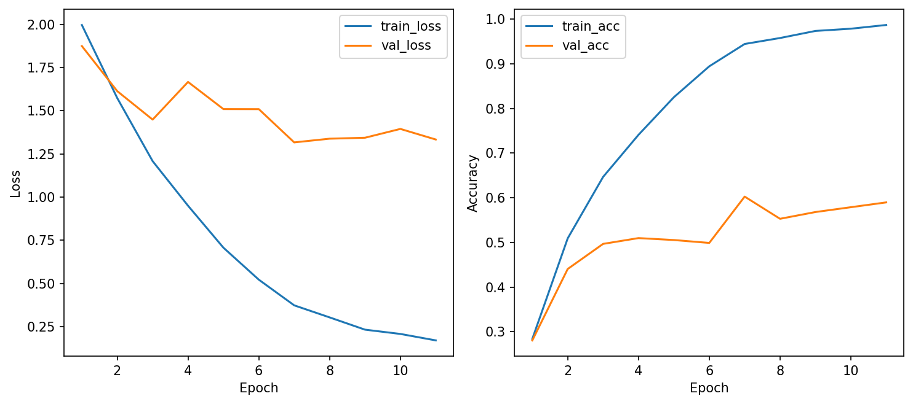
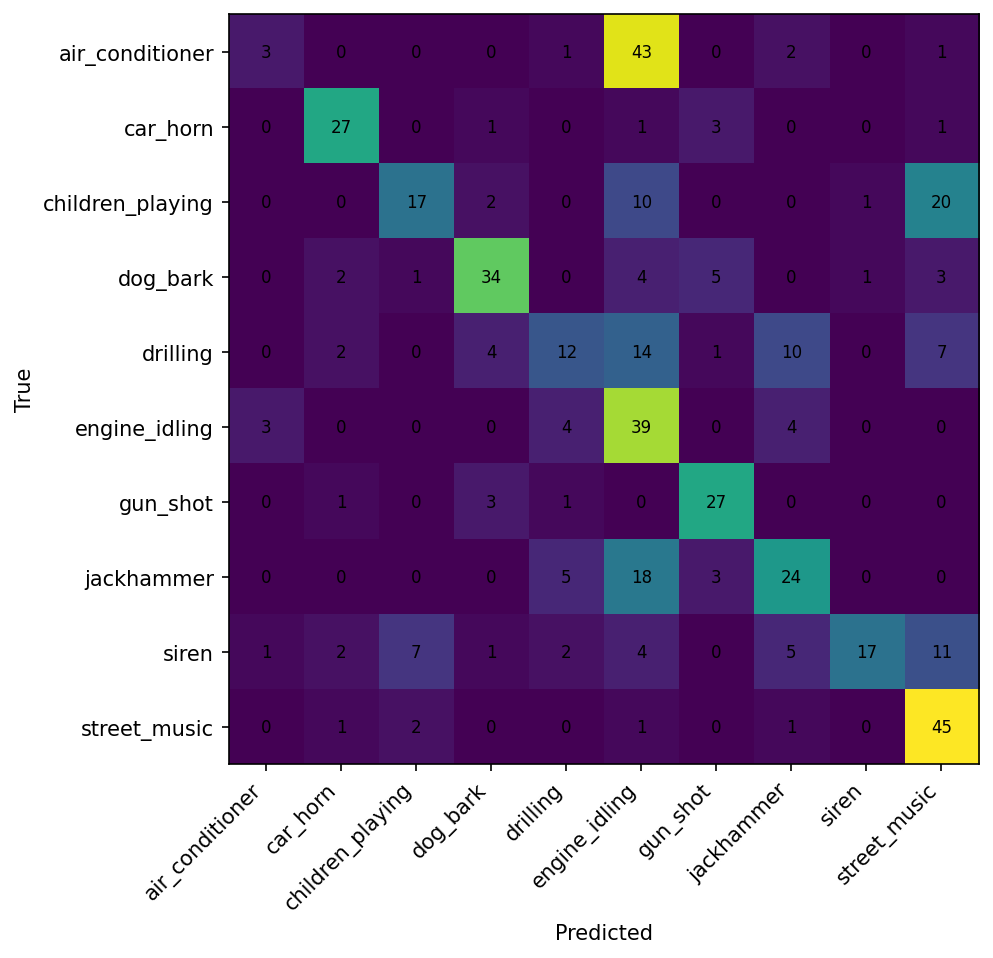

# CSC4005 Lab 3 Report – UrbanSound8K with 1D-CNN

## 1. Thông tin sinh viên

- Họ tên:Nguyễn Quang Duy
- Mã sinh viên:1771040009
- Lớp:KHMT 17-01
- Link GitHub repo:https://github.com/FIT-DNU-CS-16-01/csc4005-lab3-1dcnn-quangduy772005-oss
- Link W&B run/project:https://wandb.ai/quangduy772005-dai/csc4005-lab3-urbansound-1dcnn?nw=nwuserquangduy772005

---

## 2. Mục tiêu thí nghiệm

Lab này hướng tới các mục tiêu chính sau:

Làm quen với bài toán phân loại âm thanh môi trường (Environmental Sound Classification) trên bộ dữ liệu UrbanSound8K.

Hiểu và thực hành chuyển đổi dữ liệu âm thanh từ dạng sóng thô (raw waveform) sang chuỗi đặc trưng MFCC theo thời gian.

Xây dựng, huấn luyện và đánh giá mô hình 1D-CNN để học các mẫu cục bộ trên trục thời gian của audio.

Sử dụng công cụ Weights & Biases để theo dõi quá trình huấn luyện và phân tích kết quả qua confusion matrix.

---

## 3. Dữ liệu và tiền xử lý

3.1. Dataset

Dataset: UrbanSound8K.

Số lớp: 10 lớp.

Các lớp: air_conditioner, car_horn, children_playing, dog_bark, drilling, engine_idling, gun_shot, jackhammer, siren, street_music .

Fold dùng để train: Fold 1 đến Fold 8.

Fold dùng để validation: Fold 9.

Fold dùng để test: Fold 10.

### 3.2. Tiền xử lý audio

Cấu hình baseline đã sử dụng :

Thành phần,Giá trị
Sample rate,16000 Hz
Duration,4.0 s
Feature type,mfcc
n_mfcc,40
n_fft,1024
hop_length,512
Augmentation,False

Giải thích ngắn: Việc đưa audio về cùng sample rate nhằm đảm bảo tính đồng nhất về tần số lấy mẫu cho tất cả các tệp. Đưa về cùng độ dài (pad/crop) giúp tạo ra các input có kích thước cố định, cho phép mô hình 1D-CNN xử lý theo lô (batch size) một cách ổn định.

---

## 4. Mô hình 1D-CNN

Bảng cấu hình huấn luyện :

| Thành phần | Giá trị |
|---|---|
| model_name | mfcc_1dcnn |
| hidden_channels | 64 |
| dropout | 0.3 |
| optimizer | adamw |
| learning rate | 0.001 |
| weight decay | 1e-4 |
| batch size | 32 |
| epochs | 15 (Early stopping tại epoch 11) |
| patience | 5 |

---

## 5. Kết quả thực nghiệm

### 5.1. Kết quả chính

| Metric | Giá trị |
|---|---:|
| Best validation accuracy | 0.596 |
| Test accuracy | ~0.58 |
| Average epoch time | 0.986 |
| Total parameters | 137,930 |
| Trainable parameters | 137,930 |

### 5.2. Learning curves

Nhận xét:

Train loss/val loss: Train loss giảm sâu và đều về gần 0. Tuy nhiên, Val loss chỉ giảm đến khoảng epoch 6-7 sau đó có dấu hiệu tăng nhẹ trở lại .  

Overfitting: Có dấu hiệu overfitting rõ rệt khi Train accuracy đạt xấp xỉ 99% nhưng Validation accuracy chỉ đạt khoảng 60% .  

Early stopping: Có xảy ra tại epoch thứ 11 khi mô hình không còn cải thiện thêm trên tập validation để tránh lãng phí tài nguyên.

### 5.3. Confusion matrix

Nhận xét:
Dễ phân loại: Các lớp có âm thanh đặc trưng riêng biệt như gun_shot hoặc siren thường có độ chính xác cao.
Dễ bị nhầm: Lớp drilling và jackhammer thường bị nhầm lẫn với nhau do đặc điểm âm thanh có nhiều tiếng va đập và pattern năng lượng tương đồng.  
Nguyên nhân: Có thể do đặc trưng âm thanh tương đồng, nhiễu nền đô thị lẫn vào clip hoặc số lượng mẫu trong các fold chưa hoàn toàn cân bằng. 
---

## 6. W&B tracking

Link W&B của lượt chạy baseline:
https://wandb.ai/quangduy772005-dai/csc4005-lab3-urbansound-1dcnn/runs/sd9ox9jk

Dashboard bao gồm đầy đủ các thông tin về: Learning curves (Loss/Acc), cấu hình tham số, hệ thống log và hình ảnh kết quả ma trận nhầm lẫn .
---

## 7. Phân tích và thảo luận

Vì sao dùng 1D-CNN thay vì MLP? 1D-CNN có khả năng học các mẫu cục bộ (local patterns) biến thiên theo thời gian và giữ được tính bất biến về mặt thời gian, điều mà MLP truyền thống khó làm được do chỉ xử lý dữ liệu dưới dạng vector phẳng .  
Kernel 1D trượt theo chiều nào? Trượt theo trục thời gian (time_frames) của chuỗi đặc trưng MFCC.  
MFCC giúp gì hơn raw waveform? MFCC là biểu diễn đã tóm tắt thông tin âm thanh dựa trên cảm nhận của tai người, giúp giảm số chiều đầu vào đáng kể, loại bỏ nhiễu và cung cấp đầu vào có ý nghĩa phổ rõ ràng hơn so với tín hiệu thô cực dài .  
Hạn chế: Mô hình bị overfitting nặng, cho thấy kiến trúc hiện tại có thể quá phức tạp so với lượng dữ liệu train hoặc thiếu các kỹ thuật chuẩn hóa (Regularization) mạnh hơn.  
Cải thiện: Sử dụng Data Augmentation mạnh hơn, tăng thêm dropout, sử dụng các kiến trúc sâu hơn như ResNet-1D hoặc thực hiện 10-fold cross validation để đánh giá khách quan hơn.  
---

## 8. Bài mở rộng nếu có

Nếu làm raw waveform hoặc log-mel, điền bảng sau:

| Pipeline | Feature/Input | Test accuracy | Nhận xét |
|---|---|---:|---|
| Baseline | MFCC + 1D-CNN |  |  |
| Extension 1 | log-mel + 1D-CNN |  |  |
| Extension 2 | raw waveform + 1D-CNN |  |  |

---

## 9. Kết luận

Đã nắm vững quy trình tiền xử lý âm thanh từ đọc file đến trích xuất đặc trưng MFCC.  
Xây dựng thành công pipeline huấn luyện 1D-CNN và theo dõi qua W&B.  
Nhận thức được tầm quan trọng của việc kiểm soát Overfitting trong các bài toán Deep Learning trên dữ liệu âm thanh . 
